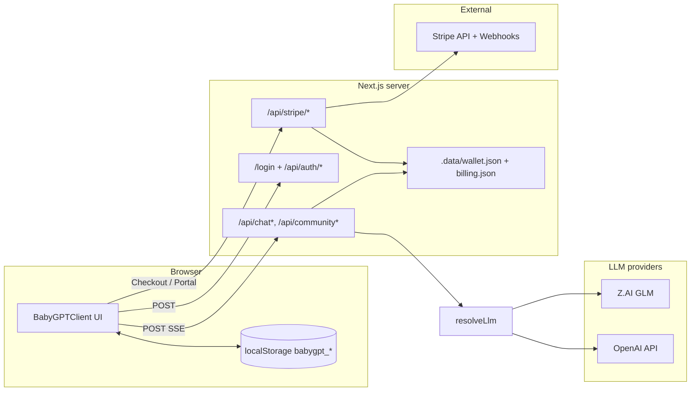

# BabyGPT — Launch handoff & system diagnostic

**App version:** `0.1.0` (see `package.json`)  
**Generated for:** operators, security review, billing integration, QA  
**Canonical pricing & credits code:** `src/lib/plans.ts`, `src/lib/usage-cost.ts`, `src/lib/credits-store.ts` (client) and `src/lib/server-wallet.ts` (gated server)

---

## 1. Install & verification (run locally)

| Step | Command | Expected |
|------|---------|----------|
| Install | `npm install` | Dependencies resolve; Node `>=20` |
| Lint | `npm run lint` | ESLint clean |
| Test | `npm run test` | Vitest passes (`src/**/*.test.ts`) |
| Build | `npm run build` | Typecheck + production build OK |
| Dev | `npm run dev` | App at `http://127.0.0.1:3000` |

**CI:** `.github/workflows/ci.yml` runs `npm ci`, lint, test, and build on pushes/PRs to `main` or `master`.

**Dependency audit:** run `npm audit` before production; address high/critical issues (do not blindly `npm audit fix --force` without testing).

---

## 2. Architecture (high level)

**Modes**

| Mode | Credits & plan | API access |
|------|----------------|------------|
| **Gate off** (`BABYGPT_APP_PASSWORD` unset) | Plan/balance in **localStorage**; UI enforces before send | Chat/community **unauthenticated**; no server wallet debit |
| **Gate on** | Server **`wallet.json`** (under `BABYGPT_DATA_DIR` or `.data/`); synced from Stripe when billing is configured | **`guardChatSend` / `guardDebate` / `guardApi`**: session cookie or `Authorization: Bearer BABYGPT_API_SECRET` |

**LLM:** `src/lib/llm-resolve.ts` prefers **Z.AI** (`Z_AI_API_KEY`); if unavailable, **OpenAI** (`OPENAI_API_KEY`). See `.env.local.example`.

---

## 3. Pricing structure (product tiers)

**USD amounts live in Stripe Products/Prices**, not in app code. Code maps **Stripe Price ID** → **`planId`** via `STRIPE_PRICE_STARTER` / `STRIPE_PRICE_PRO` / `STRIPE_PRICE_TEAM` (`src/lib/stripe-config.ts`). Webhooks and Checkout finalize call `applyStripeSubscription` (`src/lib/stripe-sync.ts`), which updates **`billing.json`** and **`setServerPlan`**.

| Plan ID | Label | Monthly credits (accrual) | Models | Agent | Schrödinger | Kolmogorov / Holographic | DNA + adiabatic |
|---------|-------|---------------------------|--------|-------|-------------|--------------------------|-----------------|
| `free` | Free | 400 | `glm-4-flash` only | No | No | No | No |
| `starter` | Starter | 4,000 | flash, air, plus | Yes | No | Yes | No |
| `pro` | Pro | 25,000 | all five tiers | Yes | Yes | Yes | Yes |
| `team` | Team | 80,000 | same as Pro | Yes | Yes | Yes | Yes |

**Welcome bonus:** `120` credits on first server wallet hydrate (`FIRST_VISIT_CREDIT_BONUS` in `src/lib/plans.ts`).

**Monthly accrual:** When the **calendar month** (`YYYY-MM`) changes vs stored `accrualMonth`, the wallet adds that plan’s `monthlyCredits` (`hydrateServerWallet` / `hydrateCredits`). This is **not** tied to Stripe’s invoice period unless you extend the code.

---

## 4. Credit economy (per action)

**Formula** (`estimateSendCredits` in `src/lib/usage-cost.ts`):

- Base weight by model: flash/air `+1`, plus `+2`, long `+3`, glm-4 `+4`.
- Add `+2` if **Thinking** is on.
- Add `+6` if mode is **Agent**.
- Add `+8` if mode is **Schrödinger** (dual stream).
- Minimum charge: `1` credit.

**Community AI debate:** fixed **`COMMUNITY_DEBATE_COST` = 6** credits.

**Gated server behavior**

- **Chat / agent / Schrödinger:** `guardChatSend` debits the **server wallet at the start of the request** (before streaming). If the stream fails after that, credits are already spent—this is a known tradeoff for simple file-based accounting.
- **Debate:** `guardDebate` debits **before** calling the LLM (same pattern).
- **Client-only mode (gate off):** `BabyGPTClient` still debits **after** a successful chat stream where applicable; debate flow follows the client panel logic.

---

## 5. Environment & configuration

Copy `.env.local.example` → `.env.local`.

| Variable | Role |
|----------|------|
| `Z_AI_API_KEY` | Primary: Z.AI / GLM |
| `Z_AI_BASE_URL` | Optional override (default in `src/lib/zai.ts`) |
| `OPENAI_API_KEY` | Fallback when Z.AI cannot be created |
| `BABYGPT_APP_PASSWORD` | If set, enables `/login` and server wallet |
| `BABYGPT_SESSION_SECRET` | JWT signing for `babygpt_token` (required when password is set) |
| `BABYGPT_API_SECRET` | Optional `Authorization: Bearer` for API scripts |
| `NEXT_PUBLIC_APP_URL` | Public origin for Stripe success/cancel/portal return (no trailing slash) |
| `STRIPE_SECRET_KEY` | Stripe SDK (Checkout, Portal, finalize) |
| `STRIPE_WEBHOOK_SECRET` | Verifies `POST /api/stripe/webhook` |
| `STRIPE_PRICE_STARTER` / `PRO` / `TEAM` | Stripe Price IDs for each tier |
| `NEXT_PUBLIC_PLAN_PRICE_STARTER_USD` / `PRO` / `TEAM` | Optional: USD/month shown in Plans modal (should match Stripe list prices) |

Without LLM keys, chat APIs return **503** with a configuration message.

**Go live:** Set `NEXT_PUBLIC_APP_URL` to your HTTPS origin, connect the repo to Vercel (or your host), add all secrets in the host dashboard, register the Stripe webhook on the production URL, then smoke-test login → Plans → Checkout (test mode first).

---

## 6. API routes

| Route | Method | Purpose |
|-------|--------|---------|
| `/api/chat` | POST | Main chat SSE |
| `/api/chat/agent` | POST | Agent loop |
| `/api/chat/schrodinger` | POST | Dual-model stream |
| `/api/community` | GET/POST | In-memory community posts |
| `/api/community/debate` | POST | For/against debate |
| `/api/credits` | GET | Server wallet + `stripe` metadata when gate on |
| `/api/credits` | POST | Set plan on server **only if Stripe is not configured**; **403** when `STRIPE_SECRET_KEY` is set |
| `/api/auth/login` | POST | Password → JWT cookie |
| `/api/auth/logout` | POST | Clear session |
| `/api/stripe/checkout` | POST | Subscription Checkout session URL |
| `/api/stripe/portal` | POST | Stripe Customer Portal URL |
| `/api/stripe/finalize` | POST | Sync subscription after Checkout (`sessionId`) |
| `/api/stripe/webhook` | POST | Stripe events (signature verified; **no JWT**) |

**Middleware** (`src/middleware.ts`): When `BABYGPT_APP_PASSWORD` is set, routes require a valid session **except** `/login`, `/api/auth/*`, and **`/api/stripe/webhook`** (verified by Stripe-Signature only).

---

## 7. Production gaps (must-read)

1. **Single-tenant server wallet.** One password gate and one on-disk wallet per deployment—not per-email SaaS. For real multi-tenant billing, add identities and a database.
2. **Ephemeral filesystem on serverless.** `.data/*.json` may not persist or may be inconsistent across **Vercel** instances. Use **durable storage** (Postgres, KV, etc.) if you scale horizontally.
3. **Client bypass when gate is off.** Without `BABYGPT_APP_PASSWORD`, APIs do not enforce credits; anyone can POST to chat. Enable the gate for any public deploy that must enforce usage.
4. **Community** remains in-memory on the server process (resets on cold start).
5. **Stripe webhook URL** must point to your **production** HTTPS origin; use Dashboard test mode until go-live.

---

## 8. UI control inventory (buttons & interactive)

| Location | Control | Connected behavior |
|----------|---------|---------------------|
| Header | **Plans** | Opens `SubscriptionModal` |
| Subscription | **Use this plan** | Local or non-Stripe server: updates plan in storage / `POST /api/credits` |
| Subscription | **Subscribe with Stripe** | `POST /api/stripe/checkout` → redirect |
| Subscription | **Manage billing** / **Open billing portal** | `POST /api/stripe/portal` → redirect |
| Header | **Credits (`… cr`)** | Server wallet when gated; else localStorage |
| Header | **Skills** | `SkillsPanel` |
| Header | **Community** | `CommunityPanel` |
| Quantum bar | **Model** | Locked by `PLANS[planId]` |
| Composer | **Send** | Client checks + server guard when gated |
| Community | **Run debate** | Server `guardDebate` when gated |
| Welcome | **Jump to live Quantum controls** | Scrolls `#babygpt-quantum-bar` (header) into view |
| Plans modal | **USD table / per-card price** | `NEXT_PUBLIC_PLAN_PRICE_*_USD`; Stripe Checkout shows the charge total |

*(Search, sidebar, smart actions, templates, toasts, message details, etc. behave as wired in `BabyGPTClient`.)*

---

## 9. localStorage keys (prefix `babygpt_`)

Used when the **gate is off**. When the **gate is on**, plan/balance for the app still come from the server (`/api/credits`); localStorage may hold conversations and other UX state.

| Key suffix | Purpose |
|------------|---------|
| `conversations` | Chat threads |
| `active_conversation_id` | Selected thread |
| `credits_v1` | Plan, balance (gate off) |
| Plus keys from `src/lib/storage.ts` (memory, skills, reminders, …) | |

---

## 10. Pre-launch checklist

- [ ] `npm run lint` / `npm run test` / `npm run build` green (local and CI)
- [ ] `.env` / host secrets: LLM keys, gate secrets, `NEXT_PUBLIC_APP_URL`, Stripe keys and Price IDs, webhook secret, optional `NEXT_PUBLIC_PLAN_PRICE_*_USD` for list prices in the Plans modal
- [ ] Stripe Dashboard: webhook endpoint `https://<production-host>/api/stripe/webhook` with subscription + checkout events
- [ ] Smoke test: login → chat → Plans → test Checkout (test mode) → confirm plan in UI → Portal cancel/downgrade
- [ ] Decide whether `.data/` persistence is acceptable on your host or migrate wallet/billing to a database
- [ ] `npm audit` and supply chain policy
- [ ] Privacy: memory is local unless you sync it later

---

## 11. Stripe live test runbook (quick)

1. Use **test mode** keys and test Prices in Dashboard.
2. Set `NEXT_PUBLIC_APP_URL` to the exact origin users hit (including `https`).
3. Sign in at `/login`, open **Plans**, pick **Subscribe with Stripe** on a paid tier; complete Checkout with [Stripe test cards](https://stripe.com/docs/testing).
4. Confirm redirect to `/checkout/return` then home; wallet `planId` matches the tier (see server logs or UI).
5. In Dashboard → **Developers → Webhooks**, confirm events delivered to `/api/stripe/webhook` (200).
6. **Manage billing** → Portal → cancel subscription; confirm app returns to **Free** after webhook processes `customer.subscription.deleted`.

---

## 12. Machine-readable manifest

See **`docs/babygpt-system.manifest.json`**.

---

## 13. Diagnostic summary (current state)

| Area | Status |
|------|--------|
| Build / TypeScript | `npm run build` |
| ESLint | `npm run lint` |
| Unit tests | `npm run test` (`stripe-config`, `stripe-sync`, `chat-route-guard`, stream/fetch/model helpers) |
| CI | `.github/workflows/ci.yml` |
| Pricing UI ↔ `PLANS` | `SubscriptionModal` + Stripe mode when gate + `STRIPE_SECRET_KEY` |
| Credits ↔ sends (gated) | `guardChatSend` + `tryDebitServerWallet` |
| Credits ↔ debate (gated) | `guardDebate` |
| Stripe | Checkout, Portal, Finalize, Webhook → `stripe-sync` + `server-billing` |
| LLM connectivity | Requires env keys; `resolveLlm()` |

*End of handoff document.*
